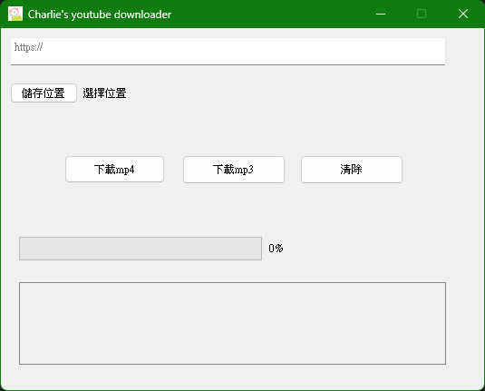

# yt_downloader



## Feature
The encoding format of the downloaded MP3 file is compatible with iPhone Music.

## How to use
- Install the dependencies
```
$ git clone https://github.com/charlieUWUuwu/yt_downloader.git
$ conda install ffmpeg
$ pip install -r requirements.txt
```

- Quick start
```
python start.py
```

- Create an Executable using PyInstaller

  (ico file is optional)
  
  - step1 : copy the folder 'path/to/ffmpeg' into the current folder

  - step2 : 
  ```
  pyinstaller -F -w --add-binary "./ffmpeg/Library/bin;." --icon=MyICON.ico start.py
  ```
